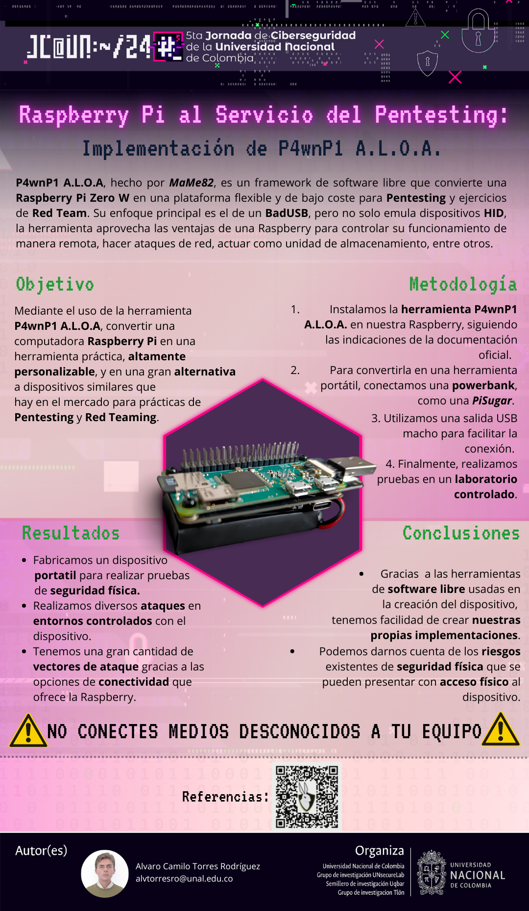

# Raspberry Pi al Servicio del Pentesting: Implementación de P4wnP1 A.L.O.A.

En esta entrada de blog te enseñaré mi **poster académico** sobre el proyecto **P4wnP1 A.L.O.A**, un framework de pentesting para **Raspberry Pi** que como función principal tiene implementar un **badUSB** en un dispositivo Raspberry Pi Zero W.

    

## Introducción

En el panorama actual de la ciberseguridad, la evaluación continua de vulnerabilidades y el desarrollo de herramientas versátiles son esenciales para garantizar la protección de sistemas y redes. P4wnP1 A.L.O.A. (All-in-One Attack Platform) es un proyecto de código abierto diseñado para convertir una Raspberry Pi en una potente herramienta multifuncional para pruebas de penetración, automatización y emulación USB.

Esta plataforma destaca por su flexibilidad y facilidad de uso, permitiendo a investigadores y profesionales de la seguridad realizar auditorías de manera eficiente. Con soporte para múltiples protocolos y la capacidad de personalizar flujos de trabajo mediante scripting, **P4wnP1 A.L.O.A.** ofrece una solución robusta para abordar desafíos en entornos complejos.

En este informe, se analizan las **características principales** de la herramienta, su **implementación práctica** y **casos de uso** relevantes. Además, se discuten las **limitaciones actuales** y el **impacto potencial** de **P4wnP1 A.L.O.A.** en el ámbito de la **ciberseguridad moderna**.

## Proceso de creación

    

La idea de la creación del dispositivo nace por la curiosidad de ver alternativas a diversos dispositivos de **hardware hacking** como lo son los **badUSB** y sus variantes, y el cómo podríamos replicar el funcionamiento de uno, lo cual te puede dar la libertad de configurar el dispositivo como uno quiera y entender bien su funcionamiento.

Lo primero que aparece como alternativa al realizar la investigación son implementaciones en chips **ESP32** o **Arduinos**, los cuales pueden replicar la funcionalidad de un **BadUSB** (Emular un dispositivo **HID** como lo sería un teclado) sin problema alguno. Realizando la implementación de estas funcionalidades a un **Arduino** se presentaron varios problemas en cuanto a compatibilidad y configuración del mismo, volviéndose una herramienta algo dispendiosa de configurar, que si bien funcionaba, no presentaba una gran experiencia de uso.

De la investigación previa con **Arduino** surgió el interés por una implementación en un dispositivo más complejo como lo sería una **Raspberry Pi**, la cual al poder montar un sistema operativo, su configuración se vuelve más amigable y se abren varias posibilidades de mejoramiento del dispositivo. Fue entonces que al hacer la búsqueda de implementaciones hechas por la comunidad se encontró una bastante completa, **P4wnP1_A.L.O.A**, una herramienta desarrollada por el usuario **RoganDawes** o ‘**MaMe82**’ (No se encuentra mucha información sobre el autor). La cual es una actualización más completa del trabajo previo con **P4wnP1**, que si bien esta nueva versión salió en 2019, sigue siendo una excelente alternativa para este tipo de dispositivos en la actualidad.

De la herramienta podemos destacar que es **software libre** (GNU V3) por lo que tenemos libertad de hacer modificaciones a este mismo y distribuirlas, y por ese lado, la herramienta es muy amigable para entender y hacer mejoras en ella. A su vez está cubre varias formas de conexión como **bluetooth**, **wifi**, **usb**, entre otras; y permite hacer ataques **Man In the Middle** con ella, portales cautivos, así que hay un canva bastante definido para desarrollar nuevas formas de ataque y personalizarlo.

En cuanto a la construcción del dispositivo, este usa como base una placa **Raspberry Pi Zero W**, donde montamos la imagen del sistema operativo que viene con la herramienta y se nos ofrece por medio del repositorio en Github, y una vez montada, la herramienta estará operativa. Como implementación propia, se optó por incorporar una batería Powerbank PiSugar la cual ya viene adaptada para la placa en específica, esto para hacerlo un dispositivo mucho más portátil y compacto, similar a los dispositivos de este estilo que se encuentran en el mercado. Adicional a esto se conectó una salida USB macho para hacer el dispositivo más portable y sigiloso, y por último mediante impresión 3d se hizo un cuerpo para el dispositivo y así hacerlo más sigiloso y estético

## Conclusiones

    

En cuanto a la creación del dispositivo, vemos que es posible fabricar dispositivos de **hardware hacking** como lo son los dispositivos **BadUSB** con piezas por separado y utilizando recursos de la comunidad que son de **fuente abierta** y **libre distribución**, haciéndolas una alternativa competitiva con el mercado y a un menor precio.

En la práctica con laboratorios en un entorno controlado, podemos observar los alcances que tiene el dispositivo y el riesgo que representa no proteger físicamente un dispositivo frente a un posible atacante, lo cual inmediatamente nos hace pensar en medidas de mitigación y prevención ante este tipo de amenazas.

------

## Referencias

* [Repositorio del framework P4wnP1 A.L.O.A](https://github.com/RoganDawes/P4wnP1_aloa)
* [Raspberry Pi Zero W](https://www.raspberrypi.com/products/raspberry-pi-zero-w/)
* [Placa adaptadora USB para Raspberry Pi Zero W Zero WH, placa de expansión, conector USB tipo A](https://es.aliexpress.com/item/1005007169673891.html?spm=a2g0o.order_list.order_list_main.5.7c08194d9j1NLf&gatewayAdapt=glo2esp)
* [Pisugar 3](https://github.com/PiSugar/PiSugar/wiki/PiSugar-3-Series)
* [Comprar Pisugar3](https://articulo.mercadolibre.com.co/MCO-2103508020-pisugar-3-portatil-de-mah-ups-bateria-de-litio-pwnagotch-_JM#polycard_client=search-nordic&position=1&search_layout=stack&type=item&tracking_id=29e0619a-3da4-448d-bae2-94baf3dd47c5)

* [Documentación Raspberry Pi](https://www.raspberrypi.com/documentation/)
* [Guía ataques físicos](https://book.hacktricks.xyz/hardware-physical-access/physical-attacks)
