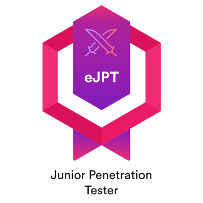
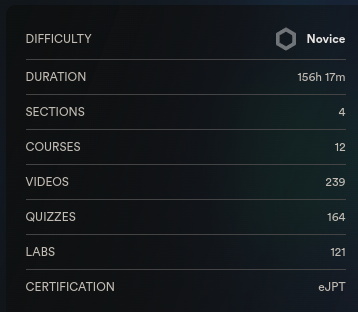

# Certificación eJPT (Junior Pentester) - Mi experiencia y reseña

En esta entrada de blog contaré mi experiencia con la certificación eJPT, cómo fue mi preparación para el examen y una reseña de la certificación.

    

## ¿Qué es el eJPT?

La certificación eJPT (eLearnSecurity Junior Penetration Tester) es una credencial de nivel inicial en seguridad informática, otorgada por eLearnSecurity. Está diseñada para evaluar las habilidades básicas en pruebas de penetración, incluyendo la identificación y explotación de vulnerabilidades en redes y aplicaciones.

La eJPT está enfocada a un público que quiere introducirse al mundo de la ciberseguridad ofensiva, por lo que evaluará todas las areas en este campo con un nivel introductorio para así validar que tengamos las bases necesarias para ser un junior en el campo del pentesting

Consiste de un exámen práctico de 35 preguntas, en el cual tendremos 48 horas para vulnerar una red que es puesta a nuestra disposición a través de un escritorio remoto ofrecido en la Web de INE. Las preguntas cubren distintos enfoques del pentesting, estas son: Auditoria de redes, metodologías de evaluación, pentesting en redes y pentesting a aplicaciones Web.

## Curso de la certificación

    

Si voy a hablar de la certificación, no puedo dejar de lado el contenido que se ofrece junto con ella, el cual es bastante amplio y completo. El curso consiste de las 4 áreas que se evalúan en el exámen y en cada área se encuentran varios cursos que en total suman 156 horas de contenido, además de que se incluyen laboratorios para practicar lo aprendido. Estos cursos son dictados por los expertos Alexis Ahmed y Josh Mason, quienes explican de forma clara y concisa los conceptos que se deben aprender. El contenido abarca todas las fases del pentesting y se le da un enfoque práctico de una auditoría de seguridad más que la de un CTF, cosa que es bastante común de encontrarse y eso le da un valor añadido, ya que se aprende a hacer pentesting de forma profesional. Aprenderás la metodología de un pentesting y el uso de herramientas clave en el campo para iniciar como lo son Nmap o Metasploit, a estas se les dedica bastante tiempo para contemplar todas sus funcionalidades, especialmente con metasploit.

Recomiendo ampliamente estos cursos incluso si ya tienes experiencia en el campo, ya que se aprenden cosas nuevas y se refuerzan conceptos que ya se conocen. Considero que para el precio que tiene la certificación y su relación costo beneficio, el contenido en cursos que te ofrece es de lo que mejor te retribuye en la compra, porque si bien la certificación te puede abrir puertas laborales, el contenido académico es contenido que te va a dejar unas muy buenas bases, contenido que contempla incluso cosas que no se evalúan en el exámen y te pueden ser de gran ayuda para alcanzar un nivel más avanzado.

## Preparación para el examen

    

Personalmente, no puedo decir que tuve una preparación en específico para este examen ya que llevo algo más de un año estudiando cosas de hacking y ciberseguridad, lo cual incluye hacer máquinas de estilo CTF regularmente, y realmente no sentí necesario hacer más que eso y el curso que se ofrece con la certificación para prepararme, ya que el contenido del curso es muy amplio e incluye laboratorios.

Para alguien que recien empieza en esto y piensa sacar la certificación, yo lo que recomendaría es hacer todo el curso o al menos lo que más se pueda y que sea más relevante para el examen, y con hacer algunas máquinas de dificultad fácil en plataformas como TryHackMe y Hack The Box a un punto de sentirse cómodo y acostumbrado a este tipo de laboratorios, sería más que suficiente para pasar el exámen.

## Examen y tips

    

El examen consiste en 35 preguntas sobre distintos temas y puntos que debemos descubrir dentro del laboratorio, este se nos ofrece de forma web, por lo que no tendremos que usar nuestro entorno de pentesting, sino que usaremos un escritorio remoto con un Kali Linux el cual traerá todas las herramientas que necesitemos. El entorno que me tocó a mi consistía en una red con 4 máquinas 'hackeables' y una red interna a la que tenemos que pivotar y hackear otra máquina interna, hay tanto máquinas Windows como Linux.

Yo pasé el examen con un porcentaje de 94% de aprobación y lo terminé al segundo día de haberlo iniciado, este se logra aprobar con un 70%. Para ayudar a quienes quieran sacar esta certificación, les dejo algunos tips que me ayudaron:

* Tomar apuntes es clave, ya sean de procedimientos que has hecho en los laboratorios, bosquejos de la red, como están conectadas las máquinas, sus características y servicios, etc. Esto te será de mucha utilidad para tener el control de todo, para el momento de responder preguntas, moverte entre máquinas si te estancas en alguna, volver a la anterior, saber que has hecho y los posibles caminos que podrías tomar

* Guarda toda la información y apuntes en tu máquina local, ya sean escaneos de nmap, capturas de pantalla, notas, etc. Esto se enlaza con el anterior consejo, y te lo digo porque puede pasar que por alguna razón se pueda reiniciar la máquina remota, cosa que no me sucedió pero no deberías depender de ello, y también es más cómodo leer los escaneos y notas en tu máquina local

* Prueba de todo empezando por lo más básico, por cada servicio intenta de todo pero siempre empezando con lo más básico, al ser una certificación de nivel introductorio no esperes explotar una vulnerabilidad muy compleja, incluso si vas a probar algo que parezca ridículo, pruébalo, nunca sabes si te va a funcionar. Si intentas de todo antes de pasar a lo siguiente, te quedas más tranquilo de no haber pasado algo tonto por alto.

* Tómalo con calma, nos dan 48 horas para hacer el examen, tiempo que es más que suficiente, aquí la clave es estar relajado y mantener tu mente concentrada, realizarlo con rapidez solo hará que se te pasen cosas por alto y puede que te llegues a frustrar. Sal, toma aire, come, toma descansos para hacer otras cosas y vuelve a intentar con ideas frescas.

## ¿Porqué escogí esta certificación?

    

Escogí esta certificación, no pora conseguir empleo rápidamente, sino para construir unas buenas bases en ciberseguridad y empezar a hacer un portafolio de seguridad. Hay que tener en cuenta que hasta ahora tengo 18 años y voy en segundo año de universidad, por lo que no tengo prisa en conseguir empleo, pero si en aprender y construir un buen portafolio que me ayude a conseguir empleo en el futuro. Encontré la eJPT como la mejor certificación introductoria por sus contenidos y reconocimiento en el sector

Al final encontré en la eJPT lo que buscaba, revisitar las bases de ciberseguridad y construir mejores cimientos, así como probarme a mi mismo para ver si estaba listo para el mundo laboral, y aunque no es una certificación muy difícil, si es un buen reto para alguien que recién empieza en el campo.

## Reseña

La certificación cumple lo que promete, es introductoria pero no deja de ser retadora para alguien que empieza en ciberseguridad, evalúa tanto conceptos técnicos (labs) como teóricos, punto que le de un añadido en comparación a certificaciones con enfoque introductorio como la CEH que no cubre mucho la parte práctica. El contenido del curso es muy completo y se le da un enfoque profesional al pentesting, cosa que se agradece mucho, y el examen es un buen reto para alguien que recién empieza en el campo.

Mi recomendación es que si quieres ganar unas buenas bases en ciberseguridad y pentesting, esta certificación es la indicada, pero considero que si necesitas la certificación para conseguir oportunidad laboral y adicionalmente tienes unos buenos conocimientos en el área, yo optaría por una certificación más avanzada como la eCPPT.