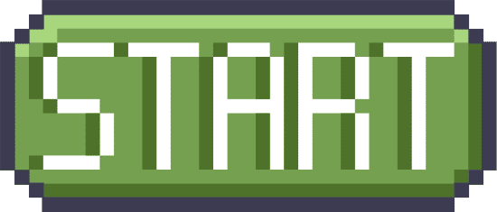
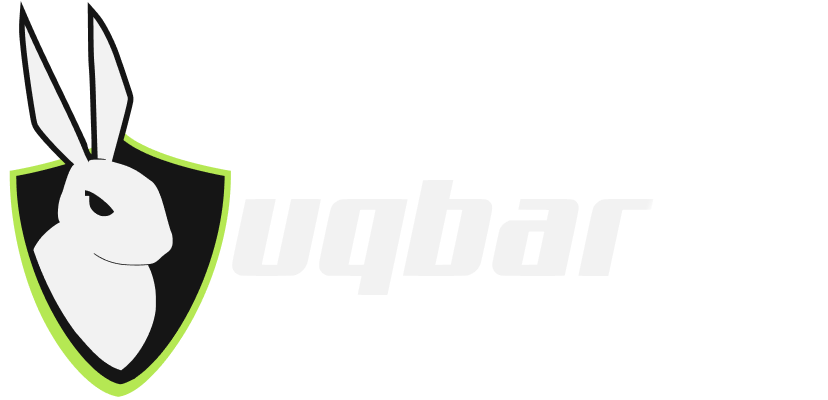

# Whoami - ¿Quién es 4LV4R0T?

¡Hola mundo, soy Álvaro Torres, AKA **4LV4R0T**! Estudiante de ingeniería de sistemas de la Universidad Nacional de Colombia y un apasionado del mundo del **pentesting** y **ciberseguridad**. En esta entrada de blog conocerás más acerca de mi y mi camino en el mundo del hacking.

## ¿Cómo inicio en todo esto?

    

Desde pequeño me interesó la tecnología, si bien no tuve acercamientos a la programación u otros campos académicos de la informática, siempre me gusto explorar los distintos programas de la computadora y ser habilidoso en su uso. Podría decir que una de las cosas pequeñas pero significativas que me atrajo de niño fue ver cómo mi hermano jugaba conmigo videojuegos de consolas retro desde emuladores, algo que si bien no es complejo de hacer, fue algo sorprendente para mi a esa edad y cosa que me impulso a ver como se hacían este tipo de cosas en una computadora, y aunque fuese solamente a nivel de como se instalaban y configuraban los emuladores puedo decir que me facilitó jugar con software posteriormente y ganar cierta "**habilidad**".

Ya estando familiarizado con las computadoras me facilitaría mi elección de carrera universitaria, sabía que tenía que estar relacionada con tecnología, después de analizarlo me decidí por **ingeniería de sistemas**, elección que a día de hoy agradezco, y a pesar de que tuve estudiar bastante pude pasar a la Universidad que quería y que hoy en día me está abriendo puertas, la **Universidad Nacional de Colombia**.

## ¿Y el hacking?

    

Yo no tuve noción de que era hacer un pentesting o de trabajo en ciberseguridad hasta el 2021 aproximadamente, a mis 16 años y en contexto de finales de pandemia, antes de eso solamente tenía nociones muy vagas sobre que era hacking, básicamente la concepción que tendría la mayoría de personas sobre un hacker, "alguien con altos conocimientos informáticos que rompe con el funcionamiento de un sistema para objetivos en su mayoría **maliciosos**", para ese entonces no me llamaba la atención.

Mi acercamiento con el hacking empezó cuando descubrí al creador de contenido de youtube **S4vitar**, al toparme con su contenido me llamó la atención los distintos temas de los que hablaba y los videos haciendo cosas "llamativas" con conocimiento en hacking, me hizo ver el área de ciberseguridad no tanto como algo para eruditos en informática, sino como algo "**cool**" e interesante. Estaba claro que el hacking me llamaba mucho la atención, pero tuve que dejarlo de lado por el momento debido a que estaba enfocado en estudiar para poder pasar el examen de admisión a mi universidad. Después de ser admitido llegué a hacer un par de cosas como instalar mi primera máquina virtual con Kali Linux (La cual no llegué a usar nunca), tratar de instalar **Arch Linux** en una máquina virtual fallando en el intento, y a inicios de 2023 instalar como nativo el Arch Linux personalizándolo todo desde cero, cosa que posteriormente me ayudaría bastante a adentrarme en ciberseguridad y sistema operativo que sigo usando a día de hoy.

Nunca llegué a adentrarme al pentesting hasta que entré a la universidad y mi enfoque cambió hacia la ciberseguridad en parte gracias a una **comunidad** que me ayudó a encontrar la pasión por la ciberseguridad.

## El grupo Uqbar

    

Ya en la universidad me entero que existe un grupo estudiantil dedicado enteramente a ciberseguridad. Entro al grupo [Uqbar](https://uqbarun.github.io/) empezando el primer semestre emocionado por poder aprender de primera mano conceptos de hacking con otros estudiantes con un conocimiento más avanzado, decido reunirme tanto a las reuniones de introducción como a las avanzadas en "**modo esponja**" tratando de absorber todo el conocimiento que pueda partiendo desde cero.

Al momento de escribir esto cumplo poco más de un año siendo un miembro activo del grupo estudiantil, y más alla del conocimiento adquirido y las oportunidades que me ha dado, he encontrado un grupo donde puedo salir un poco del mundo académico propiamente de la universidad a reunirme con **amigos** que comparten mi misma pasión, y ese tejido social que se crea es lo que realmente es invaluable.

## Experiencia y rutina hacker

    

El conocimiento que he adquirido viene de varias fuentes, por un lado están las páginas de **laboratorios** como [TryHackMe](https://tryhackme.com/) y [Hack The Box](https://www.hackthebox.com/), empecé por la primera debido a que tiene laboratorios más introductorios y amigables para gente que recién empieza, por dar una idea, en cuestión de medio año ya llevaba poco mas de **50 máquinas** de TryHackMe hechas, posteriormente me dediqué más a Hack The box. Otra fuente de conocimiento son las reuniones con el grupo **Uqbar**, donde no solamente aprendemos cosas técnas sino teoría y metodología en la industria por nombrar algunas cosas, conocimiento que sin duda es valioso, aparte de que juntarte con otros hackers te motiva y en equipo se hacen cosas grandes. Por último está todo el contenido de **internet** como cursos, videos, artículos, y libros, de todo esto destaco los cursos de hacking de S4vitar que estuve haciendo durante gran parte del 2023 y que me dio unas muy buenas bases.

En cuanto a cursos y cositas varias tengo, certificado de **inglés B2** de la escuela de bilinguismo [Centro Colombo Americano](https://www.colombobogota.edu.co/), y certificado de completados los cursos de **Introducción a Linux** e **Introducción al Hacking** de la plataforma [Hack4u](https://hack4u.io/), estos últimos son dictados por Marcelo Vázquez, AKA S4vitar, cursos con bastante contenido y gran nivel en mi opinión.

El grupo Uqbar me ha dado la oportunidad de participar en varios eventos y **CTFs**, como por ejemplo el **BSides Colombia 2023** que se realizó en las oficinas de Microsoft, ese fue mi primer CTF y pude quedar de sexto entre varias personas que participaron, fue un evento inolvidable. También participé representando a la universidad en el **Javeriana Cyber Pro 2023** en un CTF compitiendo con otras universidades, empresas e incluso entidades gubernamentales, y si bien no quedamos en un puesto muy alto me siento orgulloso de haber estado ahí. Y más recientemente estuvimos reunidos con el grupo Uqbar por más de 2 días en el CTF de **Hack The Box Universities** compitiendo contra universidades de todo el mundo, puedo decir con orgullo que quedamos de puesto 111 mundial, sextos de Latino América y primeros en el país.

Mi rutina en la actualidad consiste en hacer prioridad mi trabajo académico de la universidad, y en tiempos libres aparte del grupo Uqbar adelantar algún curso, realizar algún laboratorio solo o en grupo, o consumir contenido sobre ciberseguridad. Es cierto que aparte de todo esto hay que dejar tiempo para compartir con **familia y amigos**, y tener algun otro hobbie aparte de lo académico para despejar la mente. Uno de mis hobbies favoritos es la **música**, tanto escucharla como tocar algún instrumento, en mi caso el piano y la guitarra, considero estos pasatiempos incluso terapéuticos.

## ¿Qué es lo que sigue?

    

A la fecha de escrita esta entrada de blog, 25 de Febrero del 2024. A corto plazo tengo en mente sacar la certificación **eJPT** junto con su curso y una certificación de cloud (**ICCA**) por parte de la empresa [INE](https://ine.com/), también está un curso de directorio activo junto con su certificación (**CPAD**) hecho por [Spartan Cybersecurity](https://www.spartan-cybersec.com/), y por último en cursos pienso completar el curso de **Python ofensivo** que ofrece [Hack4u](https://hack4u.io/). Me enfocaré también en la plataforma **Hack The Box** realizando todos los laboratorios que pueda, pero además de esto intentaré junto con compañeros del grupo Uqbar ser embajador de la plataforma acá en Colombia, proyecto que me hace bastante ilusión.

Como objetivos de aquí a unos 5 años me gustaría decir que soy ingeniero de sistemas, poseo el conocimiento en ciberseguridad de por lo menos un OSCP, he asistido a varios eventos de ciberseguridad, he conseguido varios logros y certificaciones, el grupo Uqbar sigue siendo fuerte dentro de la universidad y puedo seguir aportando, tengo un empleo que me guste, y lo más importante, **soy feliz** con lo que hago y con las personas que me acompañan.

***¡A seguir estando hack!***