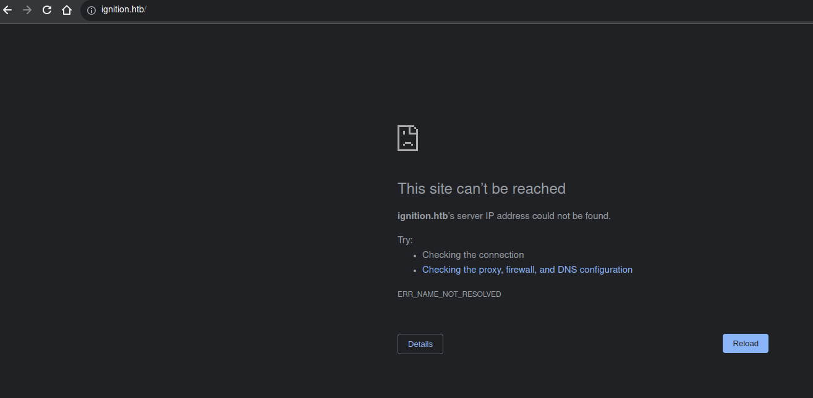
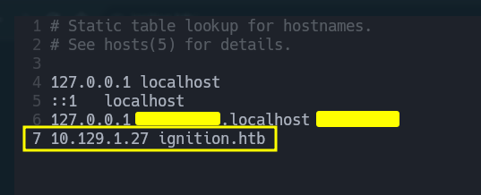
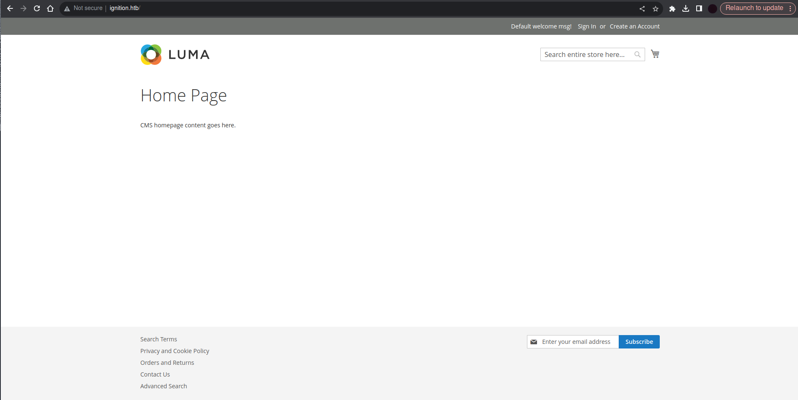
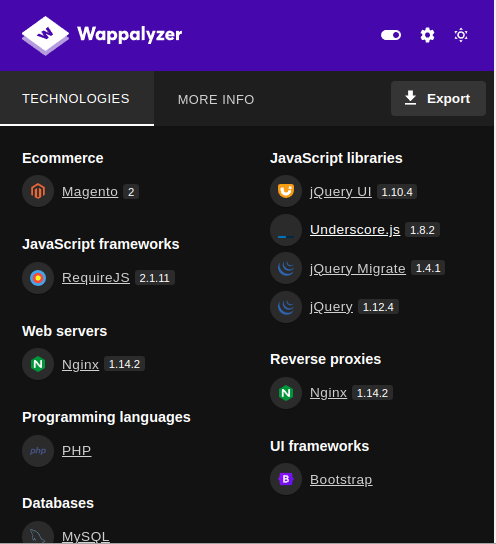
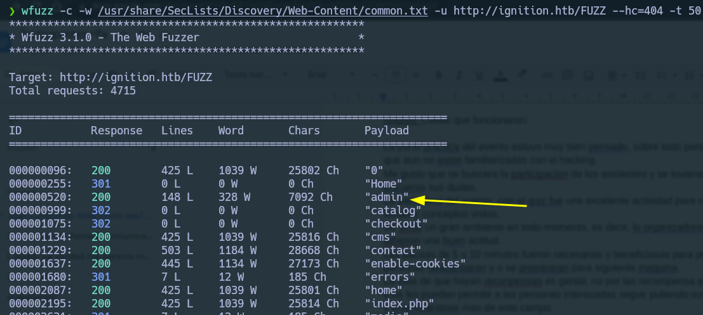
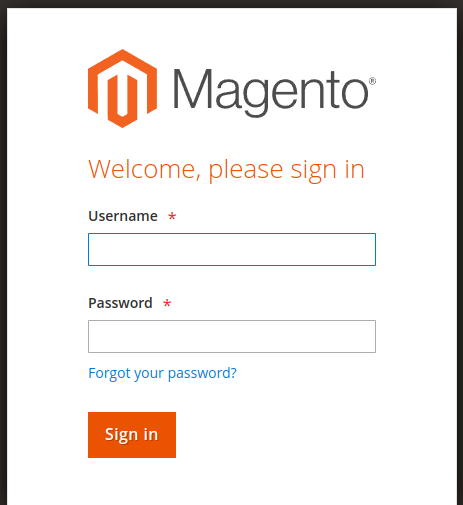
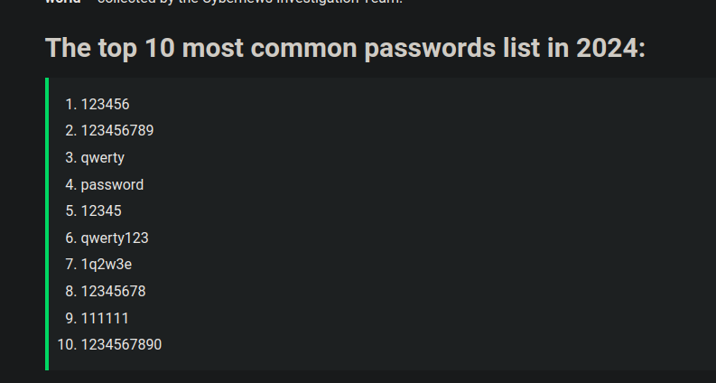
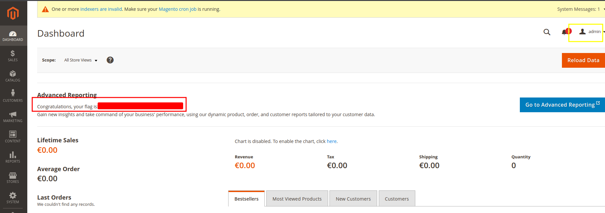
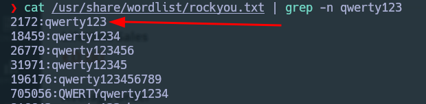

**Sistema Operativo**: Linux

**Dificultad**: Very Easy

**Temas a tratar:** Virual hosting, Fuzzing, Weak Credentials

### Reconocimiento:

Iniciada la máquina, mandamos un **ping** (ICMP echo request) a su ip, esto para verificar la conectividad que tenemos con la máquina.
```bash
ping -c 2 10.129.1.27
PING 10.129.1.27 (10.129.1.27) 56(84) bytes of data.
64 bytes from 10.129.1.27: icmp_seq=1 ttl=63 time=94.9 ms
64 bytes from 10.129.1.27: icmp_seq=2 ttl=63 time=118 ms

--- 10.129.1.27 ping statistics ---
2 packets transmitted, 2 received, 0% packet loss, time 1001ms
rtt min/avg/max/mdev = 94.928/106.559/118.190/11.631 ms
```

Como recibió el ping podemos concluir que **tenemos conectividad** con la máquina y esta está activa.

Lo siguiente es hacer reconocimiento con **Nmap** para ver que puertos están abiertos en la máquina y ver que servicios corren en ellos. En cuanto al escaneo, quiero escanear todo el rango de puertos por TCP (65355 puertos), tipo de escaneo **TCP SYN port scan**, y un par de configuraciones más para optimizar mi escaneo (esto es personalizable a las comodidades e intereses de cada quien).

```bash
sudo nmap -p- -sS --open --min-rate 2500 -vvv -n -Pn 10.129.1.27
[sudo] password for `: 
Host discovery disabled (-Pn). All addresses will be marked 'up' and scan times may be slower.
Starting Nmap 7.94 ( https://nmap.org ) at 2024-03-22 13:55 -05
Initiating SYN Stealth Scan at 13:55
Scanning 10.129.1.27 [65535 ports]
Discovered open port 80/tcp on 10.129.1.27
Completed SYN Stealth Scan at 13:56, 27.34s elapsed (65535 total ports)
Nmap scan report for 10.129.1.27
Host is up, received user-set (0.098s latency).
Scanned at 2024-03-22 13:55:43 -05 for 27s
Not shown: 65493 closed tcp ports (reset), 41 filtered tcp ports (no-response)
Some closed ports may be reported as filtered due to --defeat-rst-ratelimit
PORT   STATE SERVICE REASON
80/tcp open  http    syn-ack ttl 63
```

En esta máquina parece que solo está abierto el puerto 80 y está corriendo el servicio **HTTP**, por lo que nos estaríamos enfrentando a un servicio web

### Enumeración:

Ya sabiendo que en el puerto 80 corre un HTTP podemos enumerar como está hecho el servicio web. Para esto primero haremos un escaneo más exhaustivo con Nmap. En este escaneo usaremos los **scripts** 'default' de Nmap (-sC) y listaremos la **versión** del servicio (-sV), guardamos todo en un archivo de texto.

```bash
nmap -sCV -T4 -p80 10.129.1.27 -oN targeted
Starting Nmap 7.94 ( https://nmap.org ) at 2024-03-22 14:09 -05
Nmap scan report for 10.129.1.27
Host is up (0.11s latency).

PORT   STATE SERVICE VERSION
80/tcp open  http    nginx 1.14.2
|_http-title: Did not follow redirect to http://ignition.htb/
|_http-server-header: nginx/1.14.2

Service detection performed. Please report any incorrect results at https://nmap.org/submit/ .
Nmap done: 1 IP address (1 host up) scanned in 9.86 seconds
```

Del escaneo podemos destacar que el HTTP corre un **nginx 1.14.2** y nos aplica un redirect a la dirección http://ignition.htb/.
Esto lo podemos confirmar ingresando la IP en la url de nuestro buscador (por defecto se conecta al puerto 80), entramos y nos redirije a ignition.htb.

<p align="center">
    
</p>

Esto sucede debido a que la página está configurada para usar **Virtual Hosting**, esto se usa para alojar varias páginas web en un mismo servidor (misma IP), por lo que dependiendo el dominio ingresado nos mostrará otro contenido. No nos muestra nada debido a que ignition.htb no está en ningún registro **DNS** por lo que nuestra máquina no sabe a que dirección resuelve ese dominio. Para ello tenemos que editar nuestro archivo **/etc/hosts/**, la razón de esto es que nuestra máquina primero revisa este archivo a la hora de ver a que dominio resuelve una IP y luego revisa el registro DNS. Editamos nuestro /etc/hosts de la siguiente manera (requiere permisos de administrador):

<p align="center">
    
</p>

Solo añadimos una linea con la IP y el dominio al que queremos que resuelva. Guardamos y ahora nos debería de salir el contenido de la web:

<p align="center">
    
</p>

Ahora inspeccionemos más la web para ver que tecnologías usa, para esto usamos la herramienta **Whatweb** y la extensión **Wappalizer**:

<p align="center">
    
</p>

```bash
whatweb http://ignition.htb/
http://ignition.htb/ [200 OK] Cookies[PHPSESSID], Country[RESERVED][ZZ], HTML5, HTTPServer[nginx/1.14.2], HttpOnly[PHPSESSID], IP[10.129.1.27], Magento, Script[text&#x2F;javascript,text/javascript,text/x-magento-init], Title[Home page], UncommonHeaders[content-security-policy-report-only,x-content-type-options], X-Frame-Options[SAMEORIGIN], X-XSS-Protection[1; mode=block], nginx[1.14.2]
```

De información relevante sacamos que la web es un **Magento**, Interpreta código PHP,  tiene una base de datos SQL, etc. Esta información nos puede ser util en la explotación.

Lo siguiente sería enumerar directorios y subdirectorios dentro de la página web, para esto vamos a emplear la técnica de **Fuzzing**, que a grandes razgos es hacer bruteforcing de peticiones al servidor con posibles nombres de carpetas o archivos y ver cuales responden con un código de estado exitoso. En mi caso utilizaré la herramienta **Wfuzz** de la siguiente manera:

```bash
wfuzz -c -w /usr/share/SecLists/Discovery/Web-Content/common.txt -u http://ignition.htb/FUZZ --hc=404 -t 50
```

<p align="center">
    
</p>

Vemos una ruta interesante '**admin**' en la cual entraremos inmediatamente, y tal como sospechamos, es un login para el **panel de administrador** del magento.

<p align="center">
    
</p>

Al probar distintas contraseñas débiles y por defecto nos damos cuenta que nos bloquea un tiempo por cierto número de intentos fallidos. Para agilizar, en este punto haremos uso de las preguntas que trae la página, donde se ve que tiene 9 caracteres y termina en 3. Primero miremos qué **política de contraseñas** tiene magento, investigando nos encontramos con que la contraseña debe ser de mínimo 7 caracteres y debe contener tanto números como letras, para este punto tenemos 2 aproximaciones.
#### 1ra Aproximación:

Para esta aproximación seguimos el consejo de la pregunta en el modo guiado, miramos **contraseñas más comunes** e intentamos las que cuadren (alfanumérico, 9 caracteres y terminen en 3). Uno de los ejemplos con los que podemos encontrarnos es:

<p align="center">
    
</p>

Vemos que **qwerty123** concuerda con las pistas dadas. Probamos con el usuario por defecto (admin) y listo:

<p align="center">
    
</p>

#### 2da Aproximación:

Podemos usar la información que ya tenemos para filtrar el diccionario **rockyou.txt** con los requisitos de contraseña, por ejemplo:
```bash
grep -E "^[a-zA-Z0-9]{6}[a-zA-Z0-9]{2}3$" /usr/share/wordlist/rockyou.txt | grep -n qwerty123
5:qwerty123
```

Con una **expresión regular** que me resume todos mis requerimientos de contraseña filtramos el rockyou, buscamos en que línea del nuevo diccionario filtrado se encuentra la contraseña correcta, y vemos que es apenas en la línea 5. En cambio, en caso de no filtrarlo la contraseña se encontraría en la línea 2172.

<p align="center">
    
</p>

Esto es útil para ahorrarnos tiempo para un bruteforcing, más aún si la página bloquea intentos por periodo de tiempo. Podríamos con el **diccionario filtrado** hacer un ataque de fuerza bruta al login y eventualmente llegar a la contraseña correcta, y como está en la línea 5 no tomaría mucho tiempo.

* * *

Sea cual sea la vía a la que se llega a la contraseña, lo importante es que la **contraseña era débil** y por lo tanto fue fácil entrar al panel de administrador adivinando o haciendo fuerza bruta, gracias a este descuido del personal has podido ingresar al panel de administrador y comprometer la máquina. **¡Felicidades!**